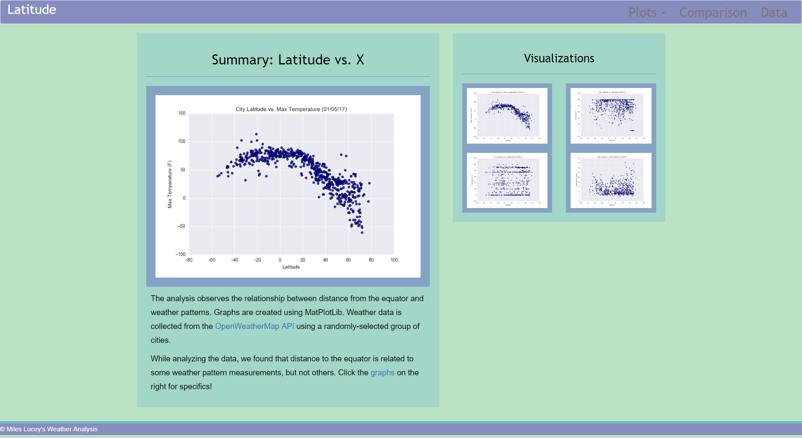

# WeatherPy Website
## Summary
* A homework assignment for UC Berkeley's Data Analytics Bootcamp
* This website displays the information uncovered in the analysis from the following repository: https://github.com/mileslucey/weatherpy
### Files
* The analysis includes the following files:
    * An "index.html" file containing the website's homepage
    * A "data.html" file containing a web page for the data behind the analysis
    * A "comparison.html" file containing web page displaying a visual comparison of all the graphs used in the analysis
    * One "styles.css" file in the "Stylesheets" folder containing the code for a lot of the website's aesthetic properties
    * Four HTML files in the "Dropdown Pages" folder; each containing a web page for each of the analysis' graphs
    * Four PNG files in the "Resources" folder; each containing a graph used in the website
    * One "cities.csv" file in the "Resources" folder containing the data used in the original analysis
## Final Product
* To view this website, click on the following link: https://mileslucey.github.io/weatherpy_website/
    
